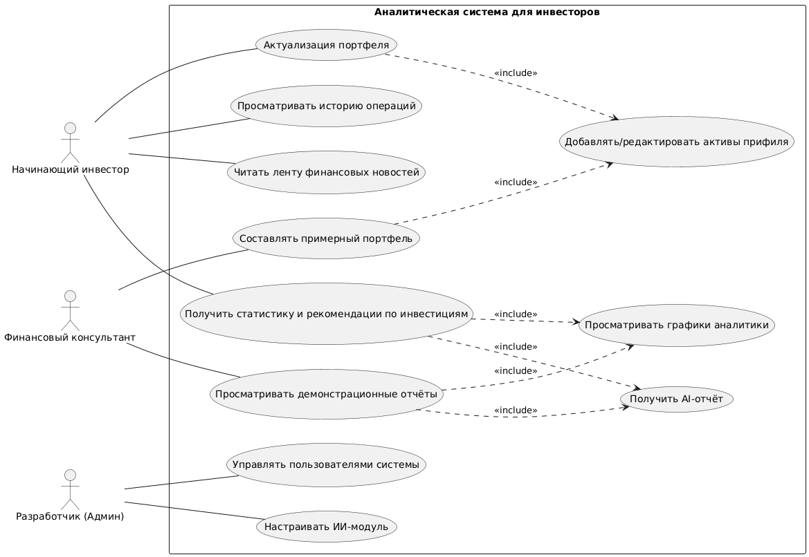

# Лабораторная работа №1
## Перечень заинтересованных лиц (стейкхолдеров)

| Стейкхолдер | Роль / Категория | Краткое описание интересов и влияния |
| :--- | :--- | :--- |
| **Начинающий инвестор** | Конечный пользователь | Основной пользователь системы. Заинтересован в простом, понятном и безопасном инструменте для учёта и анализа своих первых инвестиций без необходимости глубоких знаний. |
| **Инвест-клуб НИУ ВШЭ Пермь** | Конечный пользователь | Использует систему в образовательных и маркетинговых целях для анализа учебных или реальных портфелей. Нуждается в наглядной визуализации и теоретической аналитике. |
| **Финансовый консультант** | Конечный пользователь, косвенный клиент | Профессионал, который может использовать систему как демонстрационный или вспомогательный инструмент при работе с клиентами-новичками. Заинтересован в ясности отчётов. |
| **Разработчик** | Разработчик, тестировщик, владелец продукта | Лицо, ответственное за проектирование, реализацию, тестирование и успешную защиту ВКР. Заинтересован в создании работоспособного, документированного и релевантного решения. |
| **Научный руководитель** | Эксперт, приёмщик | Оценивает техническую корректность, полноту реализации и соответствие работы заявленной теме ВКР. |

## Перечень функциональных требований

**1. Управление пользователями и профилем**

1.1 Регистрация и аутентификация пользователя по email/паролю.

1.2 Создание и редактирование инвестиционного профиля (уровень риска, цели инвестирования).

1.3 Хранение и защита персональных данных пользователя.

**2. Управление инвестиционным кошельком**

2.1 Ручное добавление/удаление активов в портфель (название, тип: акция/облигация/иное, количество, цена покупки).

2.2 Учёт операций: покупка, продажа, пополнение счёта, вывод средств.

2.3 Автоматический расчёт текущей стоимости портфеля на основе последних известных цен.

2.4 Просмотр истории всех операций по портфелю.

**3. Генерация AI-аналитики**

3.1 Формирование структурированного текстового отчёта по портфелю, включающего: общую стоимость, доходность, уровень диверсификации.

3.2 Генерация персонализированных рекомендаций на основе профиля риска пользователя и его портфеля.

3.3 Интеграция заголовков последних финансовых новостей в контекст аналитического отчёта.

**4. Графическая визуализация данных**

4.1 Отображение интерактивного графика динамики общей стоимости портфеля за выбранный период.

4.2 Построение круговой диаграммы (pie-chart) распределения активов по типам или секторам.

4.3 Возможность экспорта графиков в формате изображения (PNG).

**5. Работа с финансовыми новостями**
5.1 Автоматическая периодическая загрузка новостных заголовков и аннотаций из внешнего API.

5.2 Отображение ленты последних финансовых новостей.

5.3 Привязка (тэгирование) новостей к типам активов, имеющимся в системе.

**6. Административные функции**

6.1 Панель для просмотра всех зарегистрированных пользователей (только для разработчика).

6.2 Управление модулем AI-аналитики для переобучения на новых данных.

## Диаграмма вариантов использования

## Перечень предположений

1.  **Данные об активах:** В связи с возможными ограничениями публичных API российских бирж (Мосбиржи) и сложностями с получением реальных котировок в реальном времени для учебного проекта, предполагается:
    *   Использование статичных или сгенерированных исторических данных о ценах активов для демонстрации.
    *   Либо реализация ручного ввода/обновления текущих цен пользователем.
2.  **AI-аналитика:** Под "AI-аналитиком" понимается не полноценная нейросеть собственной разработки, а интеграция с доступным LLM API (например, OpenAI GPT, Yandex GPT, или локально запущенной моделью типа Llama) через промпты, или детерминированный алгоритм, генерирующий текстовые отчёты на основе шаблонов и вычисленных метрик.
3.  **Безопасность:** Система является прототипом для ВКР. Предполагается, что она не будет обрабатывать реальные платежные данные (номера карт и т.д.), а только учётные записи о виртуальных портфелях.
4.  **Масштабируемость:** Архитектура проектируется с учётом возможного расширения (добавления реальных API бирж, новых типов аналитики), но в рамках ВКР реализуется базовый рабочий прототип.
5.  **Юридический статус рекомендаций:** Все генерируемые системой рекомендации носят исключительно информационный характер и не являются побуждением к совершению финансовых операций. В интерфейсе будет отображается соответствующее предупреждение.

## Перечень нефункциональных требований

**1. Требования к удобству использования:**
*   Интерфейс должен быть интуитивно понятен для пользователя без технического бэкграунда.
*   Время на освоение основных функций (добавление актива, получение отчёта) не должно превышать 10 минут.
*   Приложение должно иметь адаптивный веб-интерфейс, корректно отображающийся на экранах от 360px (мобильные) до 1920px (десктоп).

**2. Требования к производительности:**
*   Время формирования AI-отчёта (включая вызов внешнего сервиса) не должно превышать 30 секунд.
*   Загрузка страницы дашборда с графиками и сводкой должна происходить менее чем за 3 секунды при стабильном подключении к интернету.
*   Операции CRUD с портфелем (добавление/удаление актива) должны выполняться на стороне сервера менее чем за 1 секунду.

**3. Требования к надежности:**
*   Все пользовательские данные (профили, портфели) должны регулярно (раз в сутки) резервироваться.
*   При падении внешнего API новостей система должна корректно обрабатывать ошибку, не блокируя основные функции.

**4. Требования к безопасности:**
*   Пароли пользователей должны храниться в хешированном виде.
*   Доступ ко всем API-эндпоинтам, кроме публичных (регистрация, логин), должен требовать валидного JWT-токена.
*   Защита от базовых веб-уязвимостей: SQL-инъекции, XSS, CSRF.

**5. Технологические требования:**
*   **Бэкенд:** Python (FastAPI или Django REST Framework).
*   **Фронтенд:** JavaScript-фреймворк (React, Vue.js) или шаблонизатор бэкенд-фреймворка для MVP.
*   **База данных:** PostgreSQL.
*   **Контейнеризация:** Приложение должно быть упаковано с использованием Docker для обеспечения воспроизводимости окружения.
*   **Документация:** Код должен сопровождаться комментариями, должен быть написан README с инструкцией по запуску. API должен быть документирован с использованием OpenAPI (Swagger).