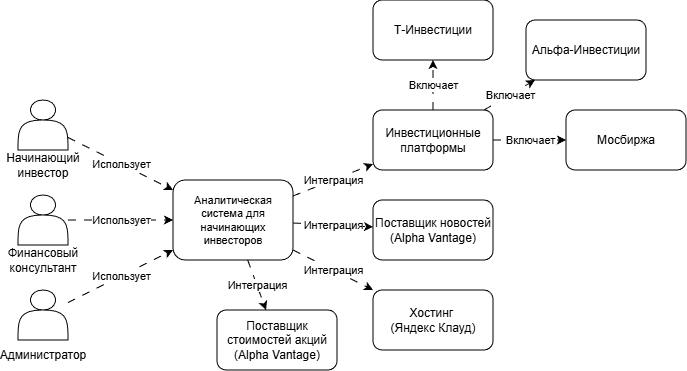
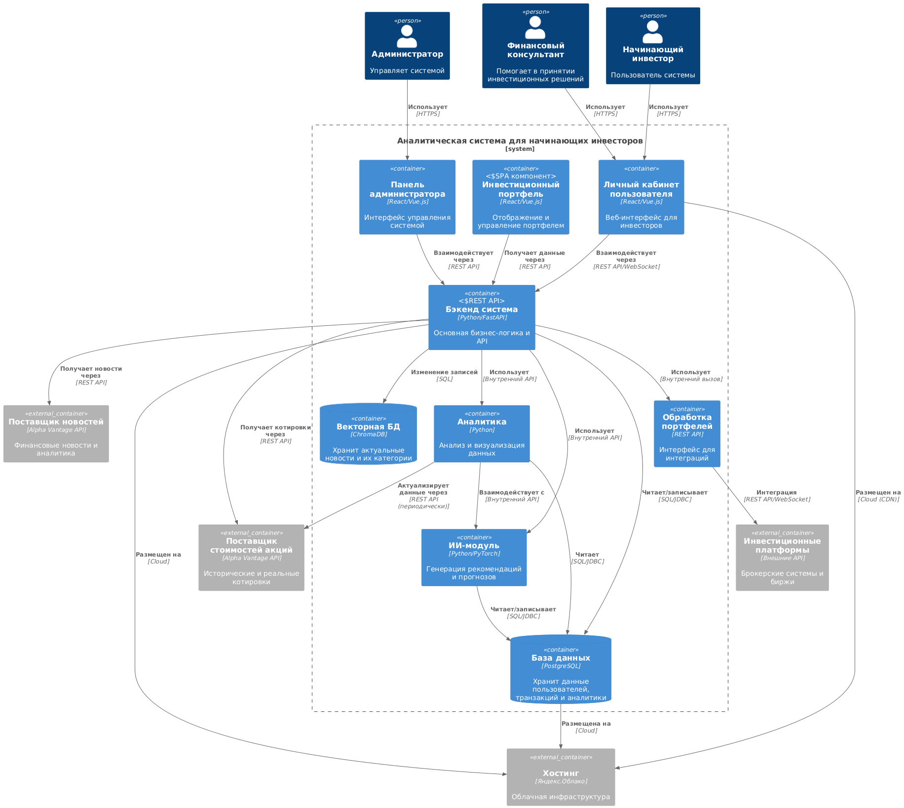
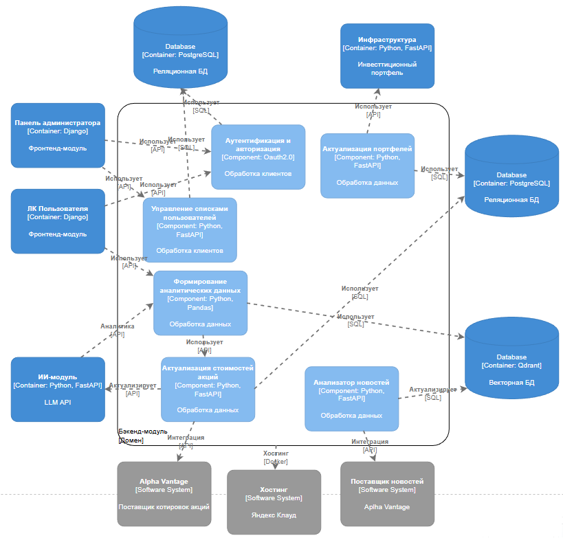
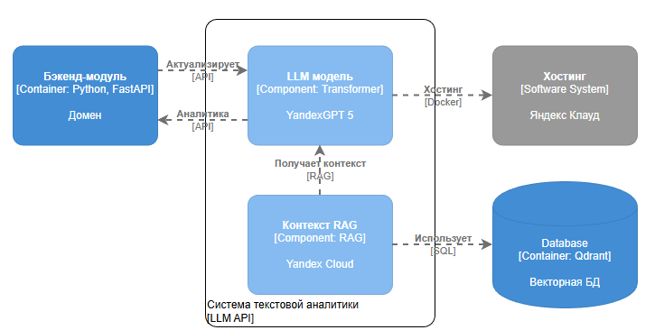

# Лабораторная работа №2. Нотация C4
**Тема:** Использование нотации C4 model для проектирования архитектуры программной системы/

**Цель работы:** Получить опыт использования графической нотации для фиксации архитектурных решений.

## Диаграмма системного контекста

На диаграмме показаны основные пользователи системы и используемые внешние сервисы.

## Диаграмма контейнеров

На диаграмме расписана структура компонентов внутри системы, взаимосвязь между ними и связь с пользователями и интеграциями.

В качестве архитектурного решения были взяты микрсервисы, так как используются отдельные модули ИИ и интеграции с внешними платформами, что удобно для реализации в виде микросервисов.

## Диаграмма компонентов (Бэкенд)

На диаграмме в деталях описана структура бэкенд-модуля. Используются 3 вида сущностей в контексте баз данных: 
- Пользователи: идентификаторы, стратегии и побочные данные
- Портфели: кошелёк - владелец, актив - кошелёк и побочные данные
- Новости: новости и их категории

## Диаграмма компонентов (ИИ-модуль)

ИИ-модуль использует RAG с целью поддержки актуальности ответов LLM на основе новейших новостей без переобучения весомой модели. Модель дообучается на данных редко.

