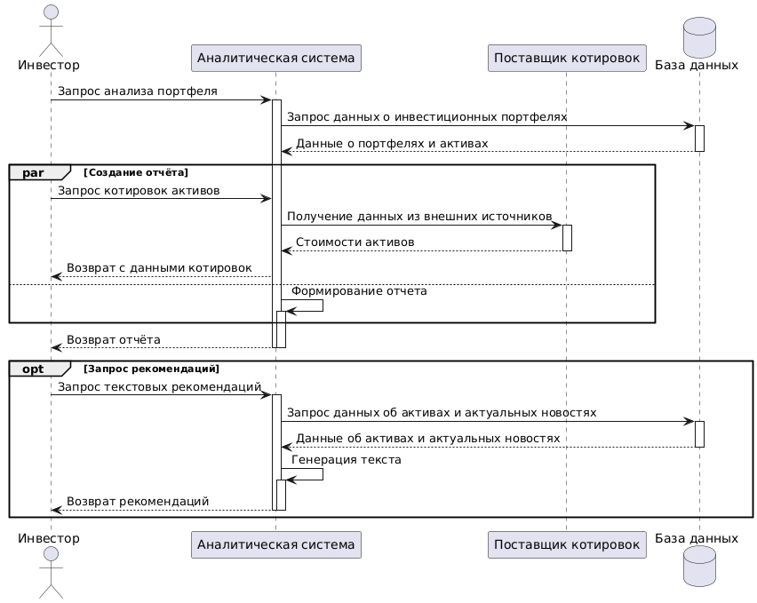
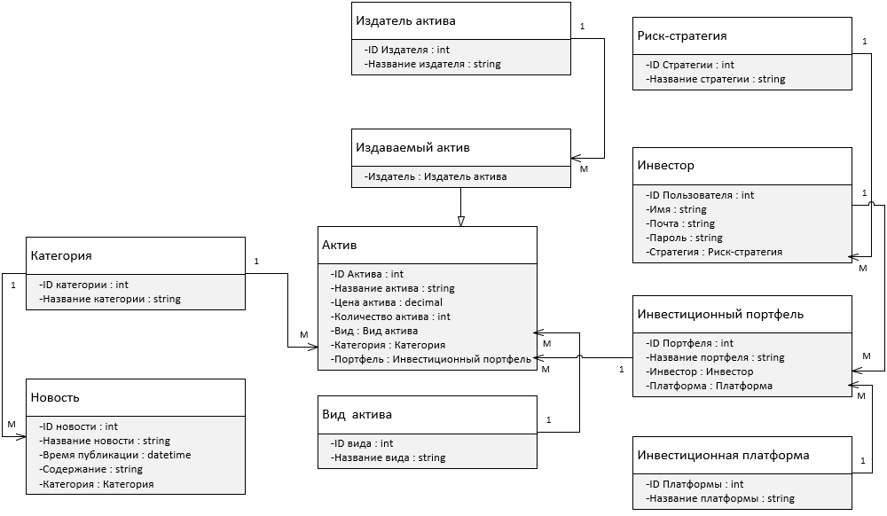

# Лабораторная работа №3
## Постановка задачи
**Для выбранного варианта использования:**
(1 балл) Добавить ранее созданные или создать диаграммы контейнеров и компонентов нотации C4 model. 

(2 балла) Построить диаграмму последовательностей для выбранного варианта использования (показать взаимодействие C4-компонентов для реализации выбранного варианта использования). 

(1 балл) Построить модель БД в виде диаграммы классов UML. Если по заданию не предусмотрена БД, то самостоятельно продумать возможное хранилище данных, связанное с заданием. Минимально количество сущностей: 5. 

(4  балла) Реализовать требуемый клиентский и серверный код с учетом принципов KISS, YAGNI, DRY и SOLID. Пояснить, каким образом были учтены эти принципы. 

(2 балла) Самостоятельно ознакомиться, кратко изложить и обосновать применимость или отказ по каждому принципу разработки в отдельности. Рассмотреть следующие принципы разработки: 
- BDUF. Big design up front («Масштабное проектирование прежде всего»)
- SoC. Separation оf concerns (принцип разделения ответственности)
- MVP. Minimum viable product (минимально жизнеспособный продукт)
- PoC. Proof of concept (доказательство концепции)

## Часть 1. Диаграммы С4

### Диаграмма контекста


### Диаграмма контейнеров


### Диаграмма компонентов (Бэкенд)


### Диаграмма компонентов (ИИ-модуль)


## Часть 2. Диаграмма последовательности

На диаграмме последовательности, изображённой на рисунке, рассмотрим процесс получения отчётов пользователем при взаимодействии с системой. Для упрощения чтения диаграммы, базы данных объединены в один объект, некоторые процессы сжаты (без уточнения / разбиения подпроцессы). 

В блоке асинхронных функций выполняется одновременный запрос данных и формирование отчёта. Формирование отчёта не может закончиться раньше подгрузки данных, поэтому процесс выходит за границу асинхронности.

Запрос генерации текстовых рекомендаций является опциональным.



## Часть 3. Модель БД

Перед построением диаграммы классов была описана диаграмма в нотации IDEF1 для моделирования предметной области. На диаграмме все связи кроме одной 1:М. Есть связь 0:М между активами и издателями.


Диаграмма классов выполнена в нотации UML. Все используемые связи имеют кратность 1..M. Проблема со связью 0..М решена через наследство.




## Часть 4. Код приложения и принципы

**Клиентский код (Console App)**:
```csharp
// Интерфейсы (абстракции)
public interface ISearchService
{
    Task<string[]> SearchAsync(string query, CancellationToken ct);
}

public interface IResultFormatter
{
    string Format(string[] results);
}

// Конкретная реализация поиска (может быть заменена)
public class SimpleSearchService : ISearchService
{
    public Task<string[]> SearchAsync(string query, CancellationToken ct)
    {
        // Имитация поиска
        var results = new[]
        {
            $"Result 1 for '{query}'",
            $"Result 2 for '{query}'",
            $"Result 3 for '{query}'"
        };
        return Task.FromResult(results);
    }
}

// Форматтеры результатов
public class ExactMatchFormatter : IResultFormatter
{
    public string Format(string[] results)
        => string.Join(Environment.NewLine, results);
}

public class StatsFormatter : IResultFormatter
{
    public string Format(string[] results)
        => $"Found {results.Length} results";
}

// Основной клиент (зависит от абстракций)
public class SearchClient
{
    private readonly ISearchService _searchService;
    private readonly IResultFormatter _formatter;

    // Внедрение зависимостей через конструктор
    public SearchClient(ISearchService searchService, IResultFormatter formatter)
    {
        _searchService = searchService;
        _formatter = formatter;
    }

    public async Task SearchAndDisplayAsync(string query, CancellationToken ct)
    {
        var results = await _searchService.SearchAsync(query, ct);
        var output = _formatter.Format(results);
        Console.WriteLine(output);
    }
}

// Конфигурация (Composition Root)
class Program
{
    static async Task Main(string[] args)
    {
        var service = new SimpleSearchService();
        var formatter = new ExactMatchFormatter(); // Легко заменить на StatsFormatter
        var client = new SearchClient(service, formatter);

        await client.SearchAndDisplayAsync("test", CancellationToken.None);
    }
}
```

**Серверный код (Minimal API)**:
```csharp
// Общий DTO (используется и клиентом и сервером)
public record SearchRequest(string Query);
public record SearchResponse(string[] Results, string Formatted);

// Тот же интерфейс, но серверная реализация
public class ServerSearchService : ISearchService
{
    public Task<string[]> SearchAsync(string query, CancellationToken ct)
    {
        // Реальная логика поиска (БД, внешние API и т.д.)
        var results = new[]
        {
            $"Server result A for '{query}'",
            $"Server result B for '{query}'"
        };
        return Task.FromResult(results);
    }
}

var builder = WebApplication.CreateBuilder(args);
builder.Services.AddSingleton<ISearchService, ServerSearchService>();
builder.Services.AddSingleton<IResultFormatter, ExactMatchFormatter>();

var app = builder.Build();

// Маршрут для поиска (KISS - минимальный эндпоинт)
app.MapPost("/search", async (SearchRequest request, ISearchService service, IResultFormatter formatter) =>
{
    var results = await service.SearchAsync(request.Query, default);
    var formatted = formatter.Format(results);
    return new SearchResponse(results, formatted);
});

app.Run();
```

**SOLID** 
- S - Каждый класс имеет единственную ответственность (SRP)
- O - `ExactMatchFormatter` и `StatsFormatter` реализуют открытое/закрытое расширение (OCP)
- I - `ISearchService` и `IResultFormatter` разделяют интерфейсы (ISP)
- D - `SearchClient` зависит от абстракций (DIP), конструктор принимает интерфейсы

**DRY (Don't Repeat Yourself)**
- Интерфейсы `ISearchService` и `IResultFormatter` используются и клиентом и сервером
- Общие DTO (`SearchRequest`/`SearchResponse`) исключают дублирование структур данных
- Логика форматирования инкапсулирована в отдельных классах

**KISS (Keep It Simple, Stupid)**
- Минимальное количество классов (только необходимые)
- Простые методы без излишней абстракции
- Прямой pipeline: запрос → поиск → форматирование → вывод
- Minimal API использует встроенную функциональность

**YAGNI (You Aren't Gonna Need It)**
- Нет лишних методов в интерфейсах (только `SearchAsync` и `Format`)
- Отсутствуют параметры "на будущее" 
- Сервис возвращает массив строк, а не сложный объект с пагинацией/метаданными (пока не нужно)
- Нет логирования или валидации (можно добавить позже при реальной необходимости)

## Часть 5. Использование принципов разработки

**BDUF** (Big Design Up Front) — Детальное проектирование перед началом разработки

Суть: Полное и детальное проектирование всей архитектуры, всех модулей и интерфейсов системы до написания первой строчки кода.

Польза от применения: ясность готовго продукта, выяснение сложностей на раннем этапе, возможность генерации документации

Убыток от применения: отсутствие гибкости к смене требований и предметной области, долгий старт, скованность при разработке.

Моё решение: этот принцип в полной мере я использовать не буду, так как требовния к проекту очень активно меняются, и мне удобнее работать в Agile, чем водопадом.

**SoC** (Separation of Concerns) — Разделение ответственности

Суть: Архитектурный и дизайнерский принцип, согласно которому система должна быть разделена на отдельные секции, каждая из которых решает свою собственную задачу. Это основа хорошей архитектуры (модульность, слоистая архитектура, микросервисы).

Польза от применения: низкая связанность кода, простота тестирования в изоляции, удобство переиспользования, простота чтения, распараллеливание работы.

Убыток от применения: повышение сложности на построение архитектуры и организацию взаимодействия, сложность распространения нагрузки.

Моё решение: этот принцип я буду использовать в рамках ВКР, так как для меня модльная архитектура даёт множество преимуществ (они описаны в ЛР2), в том числе при взаимодействии с ИИ.

**MVP** (Minimum Viable Product) — Минимально жизнеспособный продукт

Суть: Создание версии продукта с минимальным, но достаточным набором функций, чтобы проверить ключевую гипотезу на реальных пользователях и получить обратную связь для дальнейшего развития.

Польза от применения: быстрота прототипирования, проверка спроса, экономия ресурсов.

Убыток от применения: риски с неполнотой системы и плохим впечатлением, усложнение архитектуры.

Моё решение: этот принцип я буду использовать в рамках ВКР, так как для меня важно предоставлять множество готовых решений. У меня инкрементная (скрам) разработка.

**PoC** (Proof of Concept) — Доказательство концепции

Суть: Небольшой эксперимент или прототип, целью которого является проверка технической осуществимости одной конкретной, рискованной или неочевидной идеи, технологии или интеграции.

Польза от применения: снижение риска, обоснование выбора решения, ограничение ресурсов.

Убыток от применения: лишние затраты на проверку конкретных гипотез 

Моё решение: этот принцип я буду использовать в рамках ВКР, так как в ходе работы я исследую влияние документов в векторной БД и использования RAG на точность прогноза.