# Лабораторная работа №6

## Постановка задачи

**Тема**: Использование шаблонов проектирования

**Цель работы**: Получить опыт применения шаблонов проектирования при написании кода программной системы.

**Ожидаемые результаты**:

1.	Применить типовые шаблоны проектирования GoF (Gang of Four) для своего проекта. Продемонстрировать результаты в виде конечного кода и UML-диаграмм (8 баллов).
a. Порождающие шаблоны - 3 шт.
b.	Структурные шаблоны - 4 шт.
c.	Поведенческие шаблоны - 5 шт.
Возможна замена одного шаблона из другой группы шаблонов. 

2.	Проанализировать созданный код на наличие реализованных шаблонов GRASP. По необходимости реализовать (2 балла):
a.	5 ролей (обязанностей) классов
b.	3 принципа разработки
c.	1 свойство программы 


## Шаблоны проектирования GoF

### Порождающие шаблоны

#### Builder

Разные реализации Builder могут создавать разные типы отчётов:
- краткий отчёт
- полный аналитический отчёт
- отчёт для начинающего инвестора

``` py
from abc import ABC, abstractmethod

class InvestmentReport:
    def __init__(self):
        self.sections = []

    def add_section(self, text):
        self.sections.append(text)

    def show(self):
        return "\n".join(self.sections)


class ReportBuilder(ABC):

    @abstractmethod
    def add_portfolio_data(self):
        pass

    @abstractmethod
    def add_market_analysis(self):
        pass

    @abstractmethod
    def add_news_analysis(self):
        pass

    @abstractmethod
    def add_recommendations(self):
        pass

    @abstractmethod
    def get_report(self):
        pass


class BeginnerReportBuilder(ReportBuilder):

    def __init__(self):
        self.report = InvestmentReport()

    def add_portfolio_data(self):
        self.report.add_section("Portfolio summary for beginner investor")

    def add_market_analysis(self):
        self.report.add_section("Simple market trend explanation")

    def add_news_analysis(self):
        self.report.add_section("Important news affecting your assets")

    def add_recommendations(self):
        self.report.add_section("Basic recommendation: hold diversified assets")

    def get_report(self):
        return self.report


class Director:

    def __init__(self, builder: ReportBuilder):
        self.builder = builder

    def construct_report(self):
        self.builder.add_portfolio_data()
        self.builder.add_market_analysis()
        self.builder.add_news_analysis()
        self.builder.add_recommendations()
        return self.builder.get_report()


# Использование

builder = BeginnerReportBuilder()
director = Director(builder)

report = director.construct_report()
print(report.show())
```

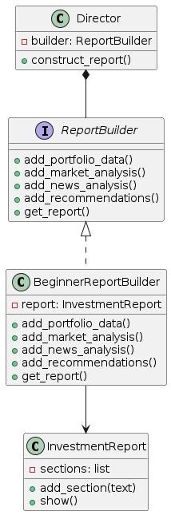

#### Factory Method

Cистема может работать с несколькими типами источников:
- новости
- рыночные котировки
- финансовые отчёты компаний
- данные портфеля пользователя
Логика обработки будет работать с абстракцией DataSource, а конкретный тип источника создаётся фабричным методом.

```py
from abc import ABC, abstractmethod


# Продукт
class DataSource(ABC):

    @abstractmethod
    def get_data(self):
        pass


# Конкретные продукты
class NewsDataSource(DataSource):

    def get_data(self):
        return "Latest financial news"


class MarketDataSource(DataSource):

    def get_data(self):
        return "Market prices and indicators"


# Создатель
class DataSourceFactory(ABC):

    @abstractmethod
    def create_source(self) -> DataSource:
        pass

    def load_data(self):
        source = self.create_source()
        return source.get_data()


# Конкретные фабрики
class NewsDataFactory(DataSourceFactory):

    def create_source(self):
        return NewsDataSource()


class MarketDataFactory(DataSourceFactory):

    def create_source(self):
        return MarketDataSource()


# Использование

def client_code(factory: DataSourceFactory):
    data = factory.load_data()
    print(data)


client_code(NewsDataFactory())
client_code(MarketDataFactory())
```

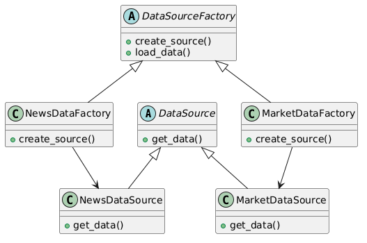

#### Sigleton

Менеджер подключения к базе данных, который используется всеми модулями системы

```py
class DatabaseConnection:

    _instance = None

    def __new__(cls):
        if cls._instance is None:
            print("Creating database connection...")
            cls._instance = super(DatabaseConnection, cls).__new__(cls)
            cls._instance.connect()
        return cls._instance

    def connect(self):
        self.connection_string = "postgresql://investment_db"

    def query(self, sql):
        return f"Executing query: {sql}"


# Использование

db1 = DatabaseConnection()
db2 = DatabaseConnection()

print(db1 is db2)  # True

print(db1.query("SELECT * FROM portfolio"))
```

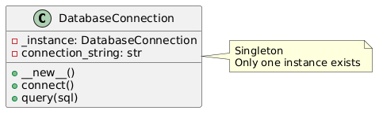

### Структурные шаблоны

#### Decorator

Базовый анализ может последовательно дополняться:
- фильтрацией шума
- кэшированием результатов
- логированием
- добавлением LLM-интерпретации
- добавлением оценки риска

Каждая функция реализуется как отдельный декоратор.

```py
from abc import ABC, abstractmethod


# Базовый компонент
class Analysis(ABC):

    @abstractmethod
    def execute(self, data):
        pass


# Конкретный компонент
class BasicAnalysis(Analysis):

    def execute(self, data):
        return f"Basic analysis of {data}"


# Базовый декоратор
class AnalysisDecorator(Analysis):

    def __init__(self, wrapped: Analysis):
        self._wrapped = wrapped

    def execute(self, data):
        return self._wrapped.execute(data)


# Конкретный декоратор: логирование
class LoggingDecorator(AnalysisDecorator):

    def execute(self, data):
        print("Logging: starting analysis")
        result = self._wrapped.execute(data)
        print("Logging: analysis finished")
        return result


# Конкретный декоратор: оценка риска
class RiskEvaluationDecorator(AnalysisDecorator):

    def execute(self, data):
        result = self._wrapped.execute(data)
        return result + " | Risk level estimated"


# Использование

analysis = BasicAnalysis()

analysis = LoggingDecorator(analysis)
analysis = RiskEvaluationDecorator(analysis)

print(analysis.execute("portfolio data"))
```

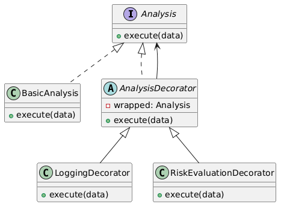

#### Bridge

Паттерн Bridge используется, когда необходимо разделить абстракцию и её реализацию, чтобы их можно было изменять независимо.

В контексте системы это удобно для генерации инвестиционных рекомендаций.

```py
from abc import ABC, abstractmethod


# Реализация (Implementor)
class AnalysisEngine(ABC):

    @abstractmethod
    def analyze(self, data):
        pass


# Конкретные реализации
class MLAnalysisEngine(AnalysisEngine):

    def analyze(self, data):
        return f"ML analysis of {data}"


class LLMAnalysisEngine(AnalysisEngine):

    def analyze(self, data):
        return f"LLM-based analysis of {data}"


# Абстракция
class InvestmentAnalysis:

    def __init__(self, engine: AnalysisEngine):
        self.engine = engine

    def perform_analysis(self, data):
        return self.engine.analyze(data)


# Расширенная абстракция
class PortfolioAnalysis(InvestmentAnalysis):

    def perform_analysis(self, data):
        result = self.engine.analyze(data)
        return f"Portfolio analysis result: {result}"


# Использование

ml_engine = MLAnalysisEngine()
llm_engine = LLMAnalysisEngine()

analysis1 = PortfolioAnalysis(ml_engine)
analysis2 = PortfolioAnalysis(llm_engine)

print(analysis1.perform_analysis("portfolio data"))
print(analysis2.perform_analysis("portfolio data"))
```

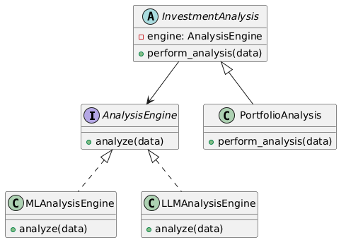

#### Facade

В аналитической системе инвестиционного анализа множество внутренних компонентов.

Фасад объединяет эти подсистемы и предоставляет клиентскому коду один простой метод

```py
# Подсистема: сбор данных
class MarketDataService:

    def get_market_data(self):
        return "Market data"


# Подсистема: анализ новостей
class NewsAnalysisService:

    def analyze_news(self):
        return "News sentiment analysis"


# Подсистема: анализ портфеля
class PortfolioAnalysisService:

    def analyze_portfolio(self):
        return "Portfolio performance analysis"


# Подсистема: генерация рекомендаций
class RecommendationService:

    def generate_recommendations(self):
        return "Investment recommendations"


# Фасад
class InvestmentAnalyticsFacade:

    def __init__(self):
        self.market_service = MarketDataService()
        self.news_service = NewsAnalysisService()
        self.portfolio_service = PortfolioAnalysisService()
        self.recommendation_service = RecommendationService()

    def generate_report(self):

        market = self.market_service.get_market_data()
        news = self.news_service.analyze_news()
        portfolio = self.portfolio_service.analyze_portfolio()
        recommendations = self.recommendation_service.generate_recommendations()

        return {
            "market": market,
            "news": news,
            "portfolio": portfolio,
            "recommendations": recommendations
        }


# Использование

analytics = InvestmentAnalyticsFacade()
report = analytics.generate_report()

print(report)
```

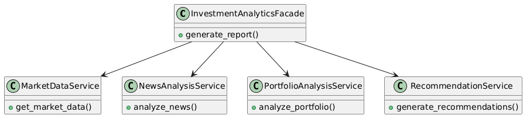

#### Flyweight

В портфелях многих пользователей могут встречаться одни и те же акции:
- SBER
- GAZP
- YNDX
- LKOH

Информация о компании (название, сектор, биржа) одинакова.

Отличается только внешнее состояние:
- количество акций
- цена покупки
- владелец портфеля

Flyweight позволяет не создавать тысячи одинаковых объектов акции, а хранить один общий экземпляр.

```py
class StockFlyweight:

    def __init__(self, ticker, company_name, sector):
        self.ticker = ticker
        self.company_name = company_name
        self.sector = sector

    def display(self, shares, purchase_price):
        return f"{self.ticker} | shares: {shares} | buy price: {purchase_price}"


class StockFactory:

    _stocks = {}

    @classmethod
    def get_stock(cls, ticker, company_name, sector):

        if ticker not in cls._stocks:
            cls._stocks[ticker] = StockFlyweight(ticker, company_name, sector)

        return cls._stocks[ticker]


# Использование

stock1 = StockFactory.get_stock("SBER", "Sberbank", "Finance")
stock2 = StockFactory.get_stock("SBER", "Sberbank", "Finance")

print(stock1 is stock2)  # True

print(stock1.display(100, 250))
print(stock2.display(50, 240))
```

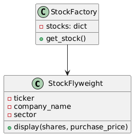

### Поведенческие шаблоны

#### Observer

В контексте проекта, это можно применить, чтобы оповещать различные модули системы (графики, отчеты, уведомления) о новых финансовых данных или изменениях портфеля пользователя

```py
from abc import ABC, abstractmethod

# Субъект
class StockData:
    def __init__(self):
        self._observers = []
        self._price = 0

    def attach(self, observer):
        self._observers.append(observer)

    def detach(self, observer):
        self._observers.remove(observer)

    def notify(self):
        for observer in self._observers:
            observer.update(self._price)

    def set_price(self, price):
        self._price = price
        self.notify()

# Наблюдатель
class Observer(ABC):
    @abstractmethod
    def update(self, price):
        pass

class PriceDisplay(Observer):
    def update(self, price):
        print(f"Текущая цена обновлена: {price}")

class RecommendationEngine(Observer):
    def update(self, price):
        if price > 100:
            print("Рекомендация: Продать актив")
        else:
            print("Рекомендация: Покупать актив")

# Демонстрация
stock_data = StockData()
display = PriceDisplay()
recommendation = RecommendationEngine()

stock_data.attach(display)
stock_data.attach(recommendation)

stock_data.set_price(120)
stock_data.set_price(80)
```

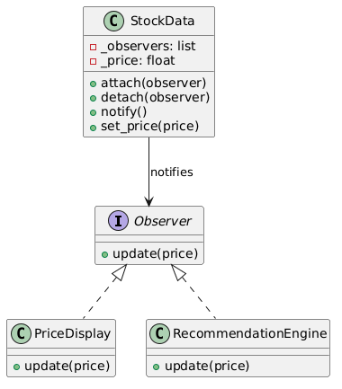

#### Command

В контексте проекта паттерн можно применить, например, для операций с инвестиционным портфелем: добавление актива, продажа актива, генерация отчета и т.д.

```py
from abc import ABC, abstractmethod

# Интерфейс команды
class Command(ABC):
    @abstractmethod
    def execute(self):
        pass

# Приемник
class Portfolio:
    def buy(self, asset, amount):
        print(f"Куплено {amount} единиц {asset}")

    def sell(self, asset, amount):
        print(f"Продано {amount} единиц {asset}")

# Конкретные команды
class BuyCommand(Command):
    def __init__(self, portfolio, asset, amount):
        self.portfolio = portfolio
        self.asset = asset
        self.amount = amount

    def execute(self):
        self.portfolio.buy(self.asset, self.amount)

class SellCommand(Command):
    def __init__(self, portfolio, asset, amount):
        self.portfolio = portfolio
        self.asset = asset
        self.amount = amount

    def execute(self):
        self.portfolio.sell(self.asset, self.amount)

# Инициатор
class Broker:
    def __init__(self):
        self._commands = []

    def take_order(self, command):
        self._commands.append(command)

    def place_orders(self):
        for command in self._commands:
            command.execute()
        self._commands.clear()

# Демонстрация
portfolio = Portfolio()
broker = Broker()

broker.take_order(BuyCommand(portfolio, "Акция А", 10))
broker.take_order(SellCommand(portfolio, "Облигация Б", 5))

broker.place_orders()
```

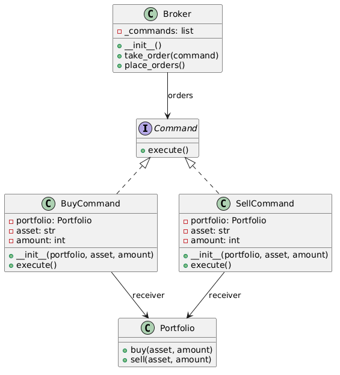

#### State

В проекте паттерн может быть применен, например, для состояния инвестора или портфеля.

```py
from abc import ABC, abstractmethod

# Интерфейс состояния
class PortfolioState(ABC):
    @abstractmethod
    def handle(self, portfolio):
        pass

# Конкретные состояния
class EmptyState(PortfolioState):
    def handle(self, portfolio):
        print("Портфель пустой. Рекомендации недоступны.")

class ActiveState(PortfolioState):
    def handle(self, portfolio):
        print("Портфель активен. Генерация стандартных рекомендаций.")

class OvervaluedState(PortfolioState):
    def handle(self, portfolio):
        print("Портфель переоценен. Рекомендации по снижению риска.")

# Контекст
class Portfolio:
    def __init__(self):
        self._state = EmptyState()

    def set_state(self, state: PortfolioState):
        self._state = state

    def request_recommendation(self):
        self._state.handle(self)

# Демонстрация
portfolio = Portfolio()
portfolio.request_recommendation()

portfolio.set_state(ActiveState())
portfolio.request_recommendation()

portfolio.set_state(OvervaluedState())
portfolio.request_recommendation()
```

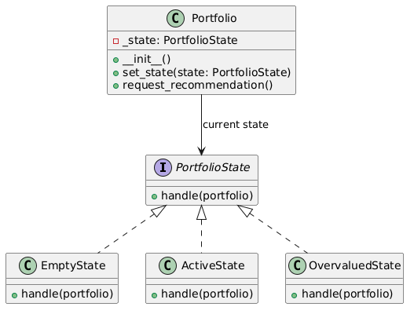

#### Strategy

В проекте паттерн можно применить, например, для алгоритмов генерации инвестиционных рекомендаций: консервативная стратегия, агрессивная стратегия, сбалансированная стратегия.

```py
from abc import ABC, abstractmethod

# Интерфейс стратегии
class RecommendationStrategy(ABC):
    @abstractmethod
    def generate(self, portfolio):
        pass

# Конкретные стратегии
class ConservativeStrategy(RecommendationStrategy):
    def generate(self, portfolio):
        print("Рекомендация: инвестировать в облигации и стабильные акции.")

class AggressiveStrategy(RecommendationStrategy):
    def generate(self, portfolio):
        print("Рекомендация: инвестировать в высокорисковые акции и стартапы.")

class BalancedStrategy(RecommendationStrategy):
    def generate(self, portfolio):
        print("Рекомендация: сбалансированный портфель: акции + облигации.")

# Контекст
class Portfolio:
    def __init__(self, strategy: RecommendationStrategy):
        self._strategy = strategy

    def set_strategy(self, strategy: RecommendationStrategy):
        self._strategy = strategy

    def generate_recommendation(self):
        self._strategy.generate(self)

# Демонстрация
portfolio = Portfolio(ConservativeStrategy())
portfolio.generate_recommendation()

portfolio.set_strategy(AggressiveStrategy())
portfolio.generate_recommendation()

portfolio.set_strategy(BalancedStrategy())
portfolio.generate_recommendation()
```

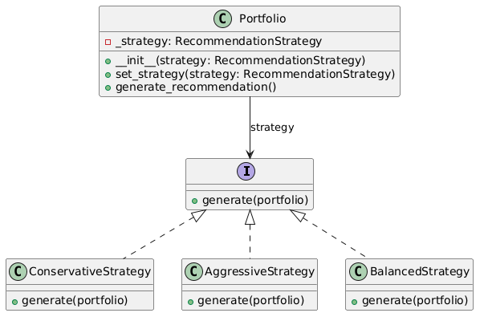

#### Template method

В проекте этот паттерн может быть применен для генерации аналитических отчетов: общий процесс один, но формат отчета или источники данных могут отличаться.

```py
from abc import ABC, abstractmethod

# Абстрактный класс с шаблонным методом
class ReportGenerator(ABC):
    def generate_report(self):
        self.fetch_data()
        self.analyze_data()
        self.format_report()
        self.send_report()

    @abstractmethod
    def fetch_data(self):
        pass

    @abstractmethod
    def analyze_data(self):
        pass

    @abstractmethod
    def format_report(self):
        pass

    def send_report(self):
        print("Отчет отправлен пользователю.")

# Конкретные реализации
class TextReportGenerator(ReportGenerator):
    def fetch_data(self):
        print("Данные получены из финансовой базы (текстовый отчет).")

    def analyze_data(self):
        print("Анализ данных завершен для текстового отчета.")

    def format_report(self):
        print("Форматирование данных в текстовый отчет.")

class GraphReportGenerator(ReportGenerator):
    def fetch_data(self):
        print("Данные получены из финансовой базы (графический отчет).")

    def analyze_data(self):
        print("Анализ данных завершен для графического отчета.")

    def format_report(self):
        print("Форматирование данных в графический отчет.")

# Демонстрация
text_report = TextReportGenerator()
text_report.generate_report()

print("---")

graph_report = GraphReportGenerator()
graph_report.generate_report()
```

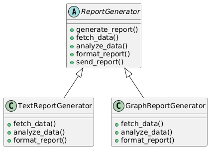

#### Mediator

В проекте можно применить паттерн для координации модулей аналитической системы: генератор отчетов, уведомления, графики, рекомендательные алгоритмы — они общаются через посредника, а не напрямую между собой.

```py
from abc import ABC, abstractmethod

# Интерфейс посредника
class Mediator(ABC):
    @abstractmethod
    def notify(self, sender, event):
        pass

# Конкретный посредник
class AnalyticsMediator(Mediator):
    def __init__(self, report_module, notification_module, graph_module):
        self.report_module = report_module
        self.notification_module = notification_module
        self.graph_module = graph_module
        self.report_module.set_mediator(self)
        self.notification_module.set_mediator(self)
        self.graph_module.set_mediator(self)

    def notify(self, sender, event):
        if event == "data_updated":
            if sender != self.report_module:
                self.report_module.generate_report()
            if sender != self.graph_module:
                self.graph_module.update_graph()
            if sender != self.notification_module:
                self.notification_module.send_notification()

# Базовый класс компонентов
class Module(ABC):
    def set_mediator(self, mediator):
        self.mediator = mediator

# Конкретные компоненты
class ReportModule(Module):
    def generate_report(self):
        print("Генерация аналитического отчета...")
        self.mediator.notify(self, "data_updated")

class NotificationModule(Module):
    def send_notification(self):
        print("Отправка уведомлений пользователям...")
        self.mediator.notify(self, "data_updated")

class GraphModule(Module):
    def update_graph(self):
        print("Обновление графиков изменений портфеля...")
        self.mediator.notify(self, "data_updated")

# Демонстрация
report = ReportModule()
notification = NotificationModule()
graph = GraphModule()

mediator = AnalyticsMediator(report, notification, graph)

# Данные обновились в графиках
graph.update_graph()
```

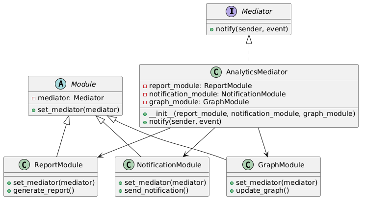

## Шаблоны проектирования GRASP

### Роли (обязанности) классов

#### Information Expert

Если объект обладает всей или большей частью информации, необходимой для выполнения задачи — именно ему и следует эту задачу поручить.

InvestmentReport, StockFlyweight, Portfolio в паттерне State/Strategy хранят свои данные и отвечают за операции с ними.

#### Creator

Если некий объект B обладает нужными данными для инициализации A, то именно B должен быть ответственен за создание A

ReportBuilder и его конкретные реализации, DataSourceFactory, StockFactory создают объекты своих продуктов.

#### Controller

Это архитектурная роль, задача которой — грамотно разрулить вход и передать его туда, где будет происходить настоящее действие.

Director управляет процессом построения отчёта, Broker управляет выполнением команд.

В качестве доп. примера REST контроллер:

```py
from fastapi import FastAPI, HTTPException
from pydantic import BaseModel
from typing import List

# --- Модели данных ---
class PortfolioItem(BaseModel):
    asset: str
    quantity: int

class PortfolioRequest(BaseModel):
    user_id: int
    items: List[PortfolioItem]

class RecommendationResponse(BaseModel):
    recommendations: List[str]

# --- Сервисный слой (Business Logic) ---
class PortfolioService:
    """Information Expert: хранит данные и генерирует рекомендации"""
    def __init__(self):
        self.user_portfolios = {}

    def add_portfolio(self, user_id: int, items: List[PortfolioItem]):
        self.user_portfolios[user_id] = items

    def generate_recommendation(self, user_id: int) -> List[str]:
        if user_id not in self.user_portfolios:
            raise ValueError("Portfolio not found")
        # Простая демонстрация рекомендации
        recs = []
        for item in self.user_portfolios[user_id]:
            if item.asset.startswith("SBER"):
                recs.append(f"Consider holding {item.asset}")
            else:
                recs.append(f"Review {item.asset}")
        return recs

# --- Контроллер (Controller, GRASP) ---
class PortfolioController:
    """Контроллер REST API: управляет запросами и вызывает сервис"""
    def __init__(self, service: PortfolioService):
        self.service = service

    def create_portfolio(self, request: PortfolioRequest):
        self.service.add_portfolio(request.user_id, request.items)
        return {"status": "Portfolio created"}

    def get_recommendations(self, user_id: int):
        try:
            recs = self.service.generate_recommendation(user_id)
            return RecommendationResponse(recommendations=recs)
        except ValueError as e:
            raise HTTPException(status_code=404, detail=str(e))

# --- Настройка FastAPI ---
app = FastAPI()
portfolio_service = PortfolioService()
controller = PortfolioController(portfolio_service)

# --- REST endpoints ---
@app.post("/portfolio")
def create_portfolio(request: PortfolioRequest):
    return controller.create_portfolio(request)

@app.get("/portfolio/{user_id}/recommendations")
def get_recommendations(user_id: int):
    return controller.get_recommendations(user_id)
```

#### Pure Fabrication

Pure Fabrication предлагает другой путь: создавать искусственные абстракции, которые:
- не отражают предметную область,
- но нужны для архитектурной чистоты,
- и соблюдают принципы Low Coupling и High Cohesion

DatabaseConnection (Singleton) создан искусственно для работы с базой, не отражает бизнес-сущность.

#### Indirection

Паттерн, снижающий жесткую связанность компонентов. Он создаёт контролируемую прослойку между объектами.

AnalyticsMediator управляет взаимодействием модулей системы, снижает прямые зависимости.

### Принципы разработки

#### Low Coupling

Чем меньше зависимостей между модулями, тем:
- выше модульность,
- меньше каскадных изменений,
- легче тестировать и заменять части системы.

Декораторы (LoggingDecorator, RiskEvaluationDecorator) и Bridge (InvestmentAnalysis + AnalysisEngine) уменьшают зависимость между компонентами.

#### High Cohesion

Когда поведение логически объединено и сфокусировано, система становится:
- проще в поддержке,
- легче для понимания,
- надёжнее при изменениях.

Каждый класс отвечает за чётко определённую задачу: анализ данных, генерация отчётов, управление портфелем. В качестве примера вынесен:

```py
# --- Класс портфеля с высокой связностью ---
class Portfolio:
    """
    High Cohesion: класс отвечает только за управление инвестиционным портфелем
    и генерацию рекомендаций через выбранную стратегию.
    Все операции, связанные с портфелем, находятся здесь: добавление активов,
    смена стратегии, генерация рекомендаций.
    """

    def __init__(self, strategy: RecommendationStrategy):
        self.assets = []  # Список активов портфеля
        self._strategy = strategy

    # --- Методы управления портфелем ---
    def add_asset(self, name: str, quantity: int, price: float):
        self.assets.append({"name": name, "quantity": quantity, "price": price})

    def remove_asset(self, name: str):
        self.assets = [asset for asset in self.assets if asset['name'] != name]

    # --- Методы работы с рекомендациями ---
    def set_strategy(self, strategy: RecommendationStrategy):
        self._strategy = strategy

    def generate_recommendation(self):
        return self._strategy.generate(self)
```

#### Polymorphism

Cпособность функции работать с объектами разных типов.

Абстрактные классы и интерфейсы: ReportBuilder, DataSourceFactory, AnalysisEngine, RecommendationStrategy позволяют выбирать реализацию в рантайме.

### Свойство программы (цель)

#### Protected Variations

Изолируй потенциально изменяемые участки стабильными абстракциями.
Предусмотри вариативность заранее — как архитектурную страховку.

Система спроектирована так, что новые виды отчетов, источники данных, стратегии анализа и состояния портфеля можно добавить без изменения существующего кода.

В качестве доп. примера:

```py
from abc import ABC, abstractmethod

# --- Protected Variations: абстракция ---
class DataProcessor(ABC):
    """
    Абстракция для всех видов анализа данных.
    Остальная система обращается только к этому интерфейсу,
    не зависимо от того, что за конкретный анализ выполняется.
    """
    @abstractmethod
    def process(self, data):
        pass

# --- Конкретные реализации анализа ---
class NewsProcessor(DataProcessor):
    def process(self, data):
        # Обработка новостей
        return f"Processed news: {data}"

class MarketProcessor(DataProcessor):
    def process(self, data):
        # Анализ рыночных котировок
        return f"Processed market data: {data}"

class LLMProcessor(DataProcessor):
    def process(self, data):
        # Анализ с помощью большой языковой модели
        return f"Processed LLM analysis: {data}"

# --- Клиентский код (не зависит от конкретной реализации) ---
class AnalyticsEngine:
    """
    Клиентская система для генерации аналитических отчетов.
    Работает только с DataProcessor, не знает конкретные реализации.
    """
    def __init__(self, processor: DataProcessor):
        self.processor = processor

    def run_analysis(self, data):
        return self.processor.process(data)

# --- Демонстрация ---
news_engine = AnalyticsEngine(NewsProcessor())
market_engine = AnalyticsEngine(MarketProcessor())
llm_engine = AnalyticsEngine(LLMProcessor())

print(news_engine.run_analysis("Latest financial news"))
print(market_engine.run_analysis("Portfolio market prices"))
print(llm_engine.run_analysis("User portfolio and news data"))
```